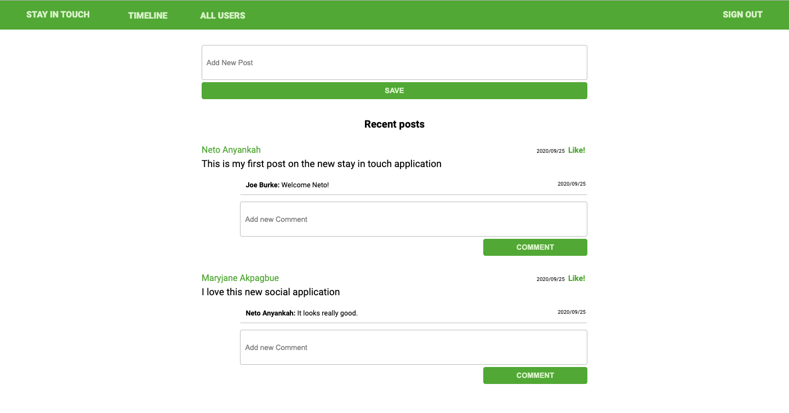

# Stay In Touch 

> "Stay In Touch" is a social media application with that allows users create accounts,send friendship requests to other existing users and view posts written by accepted friends .



## Built With

- Ruby v2.7.0
- Ruby on Rails v5.2.4
- MacOS
- VSCode

## Live Demo

[Live Demo Link ] (https://warm-ravine-81710.herokuapp.com/users/sign_in)


### Prerequisites

- Ruby: 2.6.3
- Rails: 5.2.3
- Postgres: >=9.5


### Setup

1. Clone this repository by using the Terminal to navigate to the desired location on your computer and then enter the following line of code into the Terminal:
```
git clone git@github.com:Maryjanee/Stay-In-Touch.git
```
2. Run `cd Stay-In-Touch` to move inside the downloaded repository.
3. Run `bundle install` and `Yarn install` seperately to download the project's dependencies.
4. Run `yarn check --integrity` to verify that the package dependencies have not been altered.
4. Run `rails db:setup` and `rails db:migrate` to set up your local database.
5. Run `rails console` to open a console in the environment. From here you will be able to make edits to the application from your local environment.


### Usage

Start server with:

```
    rails server
```

Open `http://localhost:3000/` in your browser.

### Run tests

```
    rpsec --format documentation
```


 Authors

👤 **Maryjane Akpagbue**

- Github: [Maryjanee](https://github.com/Maryjanee)
- Twitter: [Maryjane Akpagbue](https://twitter.com/alfredmaryjane)
- Linkedin: [Maryjane Akpagbue](https://www.linkedin.com/in/maryjane-akpagbue)


👤 **Joe Burke**

- Github: [@Joseph-Burke](hhttps://github.com/Joseph-Burke)
- Twitter: [@__joeburke](https://twitter.com/__joeburke)
- Linkedin: [Joseph Burke](https://www.linkedin.com/in/--joeburke)


## Contributing

- To contribute to this project:
- Fork this repository & clone locally.
- Create an upstream remote and sync your local copy.
- Create a new branch.
- Push your code to your origin repository.
- Create a new Pull Request .


## Show your support

Give a ⭐️ if you like this project!

## Acknowledgments

- Microverse